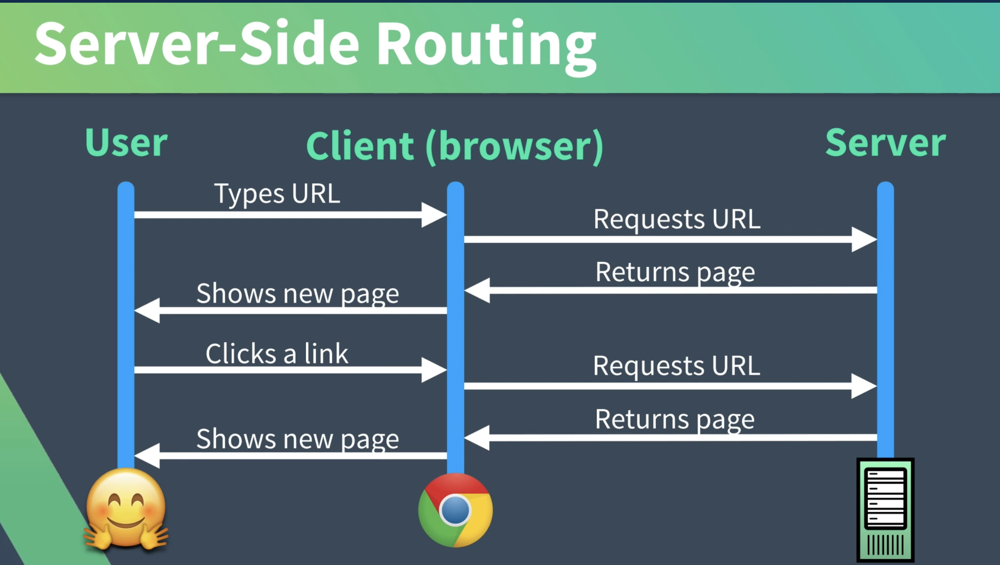

[Vue Mastery Note Home](https://github.com/coolinmc6/front-end-dev/blob/master/vue/vue-mastery.md) | 
[Vue Notes](https://github.com/coolinmc6/front-end-dev/tree/master/vue) | 
[Front End Dev](https://github.com/coolinmc6/front-end-dev) |

# Vue Mastery: Real World Vue 2

Course notes for Vue Mastery's [Real World Vue 2](https://www.vuemastery.com/courses/real-world-vue-js/)

## 2: Vue CLI 3 - Creating Our Project

## 3: Optimizing Your Editor
- install Vetur

## 4: Vue Router
- This is what traditional, server-side routing looks like:


- in the `router.js` file or, in this case, the `router/index.js` file, we create our
router.
- the first part of the code is the basics: it imports Vue it tells it that we're using
the Vue Router:

```js
import Vue from "vue";
import VueRouter from "vue-router";

Vue.use(VueRouter);
```
- after that, we create our routes (which is just an array of object, each object being a route)
- finally, we create our `router` object and export that. Here is how that all looks:

```js
const routes = [
  {
    path: "/",
    name: "Home",
    component: Home
  },
  {
    path: "/about",
    name: "About",
    // route level code-splitting
    // this generates a separate chunk (about.[hash].js) for this route
    // which is lazy-loaded when the route is visited.
    component: () =>
      import(/* webpackChunkName: "about" */ "../views/About.vue")
  }
];

const router = new VueRouter({
  mode: "history",
  base: process.env.BASE_URL,
  routes
});

export default router;
```
- The `path` is self-explanatory (`/` for home page, `/about` for the About page, etc.)
- The `name` allows us to call `router.push(name)` where `name` is the name of the route like `about`,
`user`, etc. 
  - another benefit of named routes is that if we change the URL, we only have to change it in one place
  (the router) as opposed to everywhere in the app that we're linking to that page.
- We can do it with JavaScript or HTML like this:

```js
router.push({ name: 'user', params: { userId: 123 } })
```
```html
<router-link :to="{ name: 'user', params: { userId: 123 }}">User</router-link>
```
(source: [named routes](https://router.vuejs.org/guide/essentials/named-routes.html))
- look at the About route above, it has this pattern:
```js
{
  component: () => import(/* webpackChunkName: "about" */ "../views/About.vue")
}
```
- as the comment indicates, it creates a separate chunk for that route that is lazy loaded
when the user goes to it
- Another part of the setup is in the `main.js` file which tells the Vue app to actually
use the router that we just created:

```js
import Vue from "vue";
import App from "./App.vue";
import router from "./router"; // Import the router
import store from "./store";

Vue.config.productionTip = false;

new Vue({
  router, // tell Vue to use it
  store,
  render: h => h(App)
}).$mount("#app");
```
- The view or component that you want to have rendered is shown in the `<router-view />` element.
- *View vs. Component:* a "view" is like a page: Home, About, Login, etc. While it is also a Vue component, 
if it gets a route, we can consider a "view". A "component" is also a Vue component but here you'd put
components that you use your views. Like custom buttons, links, whatever. Any components that your app 
uses but do NOT are not actually a page, would go in the "components" folder.


### Commands and Vue CLI Info

- Project setup
```
yarn install
```
- Compiles and hot-reloads for development
```
yarn serve
```
- Compiles and minifies for production
```
yarn build
```
- Lints and fixes files
```
yarn lint
```
- Customize configuration
See [Configuration Reference](https://cli.vuejs.org/config/).
